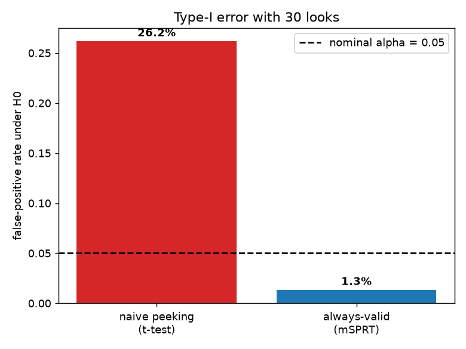
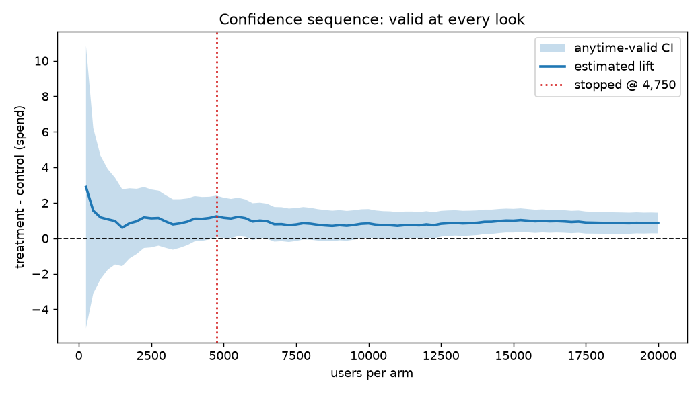

# A/B Testing Toolkit

A small, rigorous, **pip-installable** library for online experiments, covering
the three things that separate a trustworthy experiment read from a naive one:

1. **Power analysis** — how many users you actually need before you start.
2. **CUPED variance reduction** — reach significance with far fewer users by
   exploiting pre-experiment data.
3. **Always-valid sequential testing (mSPRT)** — peek at results as often as
   you like without inflating your false-positive rate.

Everything is tested, documented, and demonstrated end-to-end on both a
reproducible synthetic experiment and a real public A/B-test dataset.

---

## Why this exists

Most A/B-test bugs aren't code bugs — they're statistics bugs, and they
systematically manufacture fake wins:

- **Peeking.** Watching a p-value and stopping when it crosses 0.05 sounds
  harmless. It isn't. With 30 looks, the false-positive rate climbs from the
  nominal 5% to **~26%** — one in four "wins" is noise.
- **Under-powered tests** that can never detect the effect they're chasing.
- **Ignoring pre-experiment data**, leaving large, free variance reductions
  (and weeks of traffic) on the table.

This toolkit implements the standard, defensible fixes for each.

## Headline result: peeking destroys your false-positive rate

Under the null hypothesis (no true effect), simulated 2,000 times with 30 looks
each:

| Method | False-positive rate | Nominal |
|--------|--------------------:|--------:|
| Naive peeking (t-test at every look) | **25.8%** | 5% |
| Always-valid mSPRT (this toolkit)    | **1.8%**  | 5% |



The always-valid confidence sequence stays valid at *every* look, so you can
stop as soon as it excludes zero:



---

## Methods

**Power analysis** (`abtest.power`). Normal-approximation sample-size and power
for difference-in-means (Cohen's d or raw units) and two-proportion tests.

**CUPED** (`abtest.cuped`). *Controlled-experiment Using Pre-Experiment Data.*
For a pre-treatment covariate `X` correlated with outcome `Y`:

```
Y_cuped = Y - theta * (X - E[X]),   theta = Cov(Y, X) / Var(X)
```

The estimator is unbiased and the variance shrinks by exactly `rho²` (the
squared `Y`–`X` correlation). On the demo data this is a **45% variance
reduction → 45% fewer users for the same power.**

**Sequential / always-valid** (`abtest.sequential`). Mixture SPRT with a
`N(0, tau²)` prior on the true effect. The mixture likelihood ratio is a
non-negative martingale under H0, so by Ville's inequality the always-valid
p-value `min(1, 1/Λ)` controls type-I error *uniformly over time*. Inverting the
test yields an anytime-valid **confidence sequence**. `tau` affects power only,
not validity.

> References (please verify exact citations independently): Deng, Xu, Kohavi &
> Walker, *Improving the Sensitivity of Online Controlled Experiments by
> Utilizing Pre-Experiment Data* (WSDM 2013); Johari, Pekelis & Walsh,
> *Always Valid Inference* (2017/2022); Howard, Ramdas, McAuliffe & Sekhon,
> *Time-uniform confidence sequences* (2021).

---

## Install

```bash
git clone https://github.com/<your-username>/ab-testing-toolkit.git
cd ab-testing-toolkit
pip install -e .          # installs the `abtest` package
pip install -r requirements.txt   # or just: pip install matplotlib pytest
```

Requires Python 3.10+.

## Quickstart

```python
from abtest import sample_size_means, run_cuped_test, MSPRT

# 1. Plan: how many users to detect a $1 lift on a metric with sd=18?
n = sample_size_means(mean_diff=1.0, sd=18.0, power=0.80)   # -> per-arm N

# 2. Analyse with variance reduction:
cuped = run_cuped_test(y_control, x_control, y_treatment, x_treatment)
print(cuped)          # theta, correlation, % variance reduced, adjusted test

# 3. Peek safely, look-by-look:
seq = MSPRT(alpha=0.05, mde=1.0).analyze(y_control, y_treatment, step=250)
print(seq.rejected, seq.stopped_at, seq.p_value[-1])
```

## Run the demos

```bash
python data/generate_synthetic.py   # create the reproducible dataset
python examples/demo.py             # full walkthrough + figures

# optional real dataset (see docstring for the 1-line Kaggle download):
python examples/cookie_cats_demo.py
```

Sample output from `examples/demo.py`:

```
1. POWER ANALYSIS
   Spend metric: to detect a $1.00 lift (sd=$18.8) at 80% power -> 5,520 users/arm.
2. FIXED-HORIZON TESTS
   Spend      estimate=+0.8619 95% CI=(+0.49, +1.23) p=0.0000 -> significant
   Conversion estimate=+0.0049 95% CI=(-0.001, +0.011) p=0.1160 -> not significant
3. CUPED
   variance reduction=45.3%  ->  CI 26% narrower  ->  45% fewer users
4. SEQUENTIAL / ALWAYS-VALID
   Significant at n=4,750/arm (fixed-horizon plan wanted 5,520/arm)
```

## Tests

```bash
pytest -q     # 16 tests
```

The suite includes the key correctness check: a simulation confirming naive
peeking inflates the false-positive rate above 15% while the mSPRT keeps it at
or below the nominal level.

## Project structure

```
ab-testing-toolkit/
├── abtest/                 # the library
│   ├── power.py            # sample size & power (means, proportions)
│   ├── frequentist.py      # Welch t-test, two-proportion z-test
│   ├── cuped.py            # CUPED variance reduction
│   └── sequential.py       # mSPRT: always-valid p-values & confidence sequences
├── tests/                  # pytest suite (incl. type-I error simulation)
├── examples/
│   ├── demo.py             # end-to-end walkthrough on synthetic data
│   └── cookie_cats_demo.py # real public A/B-test dataset
├── data/generate_synthetic.py
├── figures/                # generated result plots
├── pyproject.toml          # pip-installable package
└── README.md
```

## Possible extensions

- Sequential testing for proportions and ratio metrics
- Group-sequential designs with alpha-spending (O'Brien–Fleming) as an alt to mSPRT
- Multiple-comparison control across many metrics/variants
- Sample-ratio-mismatch (SRM) and pre-experiment A/A checks
- A small Streamlit dashboard over the toolkit

## License

MIT — see [LICENSE](LICENSE).
